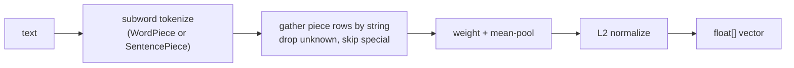
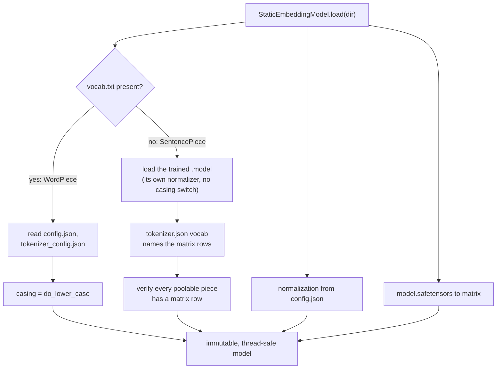
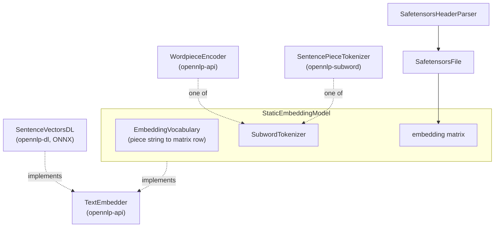

<!--
   Licensed to the Apache Software Foundation (ASF) under one or more
   contributor license agreements.  See the NOTICE file distributed with
   this work for additional information regarding copyright ownership.
   The ASF licenses this file to You under the Apache License, Version 2.0
   (the "License"); you may not use this file except in compliance with
   the License.  You may obtain a copy of the License at

       http://www.apache.org/licenses/LICENSE-2.0

   Unless required by applicable law or agreed to in writing, software
   distributed under the License is distributed on an "AS IS" BASIS,
   WITHOUT WARRANTIES OR CONDITIONS OF ANY KIND, either express or implied.
   See the License for the specific language governing permissions and
   limitations under the License.
-->

# OpenNLP Static Embeddings

Embeddings have become an essential part of AI workloads. As such, OpenNLP introduces a pure-JVM approach to embeddings with a modern Model2Vec engine.

Turn text into embedding vectors from a static (non-contextual) table: a per-token vector matrix plus subword tokenization, WordPiece or SentencePiece. It is the modern successor to the word2vec and GloVe workflow. Distillation tools can compress a sentence-transformer into such a flat table (the Model2Vec family is the primary target), and looking a sentence up in the table approximates the transformer's semantics at a fraction of the cost. Because SentencePiece models are supported, this includes multilingual tables distilled from encoders like the XLM-RoBERTa family. There is no model forward pass, no GPU, and no native runtime; it is pure JVM.

OpenNLP also supports ONNX models, which are inherently more accurate. Model2Vec sacrifices some accuracy for a large speed gain, and OpenNLP recognizes that trade-off, so both embedding methods are supported and share the same `TextEmbedder` seam.

## Quickstart

Point `load` at a downloaded model directory, then embed:

```java
StaticEmbeddingModel model = StaticEmbeddingModel.load(Path.of("/path/to/model-directory"));

float[] vector     = model.embed("The quick brown fox");
double  similarity = model.similarity("coffee", "espresso");
List<Neighbor> near = model.mostSimilar("coffee", 5);
```

The directory is the layout published releases use, and `load` detects the tokenizer family from the files present. A WordPiece model carries `vocab.txt`, `model.safetensors`, `config.json`, and `tokenizer_config.json`. A SentencePiece model carries a trained `.model` file (`sentencepiece.bpe.model`, `spiece.model`, or `tokenizer.model`) next to `tokenizer.json`, `model.safetensors`, and `config.json`. In both cases the tokenizer and pooling switches are read from the model's own config. One loaded model is immutable and thread-safe, so it can serve every thread of an application.

A multilingual SentencePiece table embeds different languages into the same space, so similarity works across them:

```java
model.similarity("The weather is beautiful today", "今天天气很好");  // same meaning, high score
```

## When to use it

Reach for this when embedding throughput and deployment simplicity matter more than the last few points of retrieval quality: semantic similarity, deduplication, candidate retrieval in front of a heavier reranker, clustering, or features for a classifier. A contextual model is still the better choice when the task depends on distinguishing word senses in context.

## How it works

A static embedding model is a vocabulary and a matrix: one row per token, each row a vector of the model's dimension. Embedding runs entirely as table lookups and arithmetic:



1. **Tokenize.** The model's own subword tokenizer splits the text into pieces: WordPiece with the model's casing rule, or a trained SentencePiece model that carries its own text normalizer. Special pieces (the WordPiece `[CLS]`/`[SEP]`/`[UNK]` frame, a SentencePiece model's control and unknown pieces) never contribute to the pooled vector.
2. **Gather.** Each piece contributes its matrix row, found by the piece *string* rather than the tokenizer's numeric id. The two files of a SentencePiece model routinely order and offset their ids differently (the fairseq convention shifts them by one, and distillation tools reorder the vocabulary outright), so string lookup is what keeps the pairing robust; a poolable piece with no matrix row fails loud at load time, not at query time. Unknown pieces are dropped, and a text with no in-vocabulary pieces embeds to a zero vector rather than raising.
3. **Weight and pool.** Per-token weights (when the model carries them) multiply into the running sum, and the sum is divided by the plain token count. This mean-pool matches the reference implementation of the targeted model family exactly, verified against it rather than assumed.
4. **Normalize.** The pooled vector is L2-normalized by default so cosine similarity is a dot product. Normalization can be turned off for models that expect raw pooled vectors.

Per-row L2 norms and the special-token mask are precomputed at load time, so the neighbor scan and similarity calls do not recompute them on every query.

### Loading

The one-argument `load` reads the model's own configuration to resolve the tokenizer and pooling switches, so callers do not restate them:



The weights are read with a purpose-built **safetensors** reader. Unlike pickle-based checkpoint formats, safetensors carries no executable content, so loading a downloaded file cannot execute arbitrary code. Tensor data streams directly into the decoded array, so the file size is not bound by Java's int-indexed arrays; a single decoded tensor is capped at the maximum Java array length (about 2.1 billion float elements), checked explicitly.

## Architecture



Two seams keep the module small. `SubwordTokenizer` is the tokenization seam: the WordPiece encoder from `opennlp-api` and the pure-JVM SentencePiece implementation from `opennlp-subword` both produce the same piece stream, so the pooling code has exactly one path. `TextEmbedder` is the embedding seam: the static path here and the contextual ONNX path in `opennlp-dl` both implement it, so callers can swap one for the other without touching their code.

## Performance

A static table wins on speed and footprint because there is no model forward pass: the hot path is a vocabulary lookup, a handful of vector adds, and one normalization. The module ships a JMH benchmark (`StaticEmbeddingModelBenchmark`) that measures `embed()` and `mostSimilar()` throughput, so you can reproduce numbers on your own hardware and model.

In our measurements on the potion-base-8M distilled table, the JVM path ran roughly an order of magnitude faster single-threaded than the model2vec Python reference on the same table, at around a fifth of the resident memory, with output vectors matching the reference within floating-point tolerance. Parity was established before any of the throughput work, so the speed is not bought with accuracy. Treat these as a starting expectation: results depend on the model, the text length distribution, and the hardware, so run the benchmark on the model you plan to use.

## Usage

### Loading a non-standard layout

For a model laid out differently, the explicit overloads take the data files and the model properties directly. WordPiece:

```java
StaticEmbeddingModel model = StaticEmbeddingModel.load(
    Path.of("vocab.txt"), Path.of("model.safetensors"),
    StaticEmbeddingModel.Casing.UNCASED,      // from the model's do_lower_case
    StaticEmbeddingModel.Normalization.L2);   // from the model's config
```

SentencePiece (no casing switch, because the `.model` file carries the model's own text normalizer):

```java
StaticEmbeddingModel model = StaticEmbeddingModel.loadSentencePiece(
    Path.of("sentencepiece.bpe.model"), Path.of("tokenizer.json"),
    Path.of("model.safetensors"),
    StaticEmbeddingModel.Normalization.L2);
```

### Neighbors and analogies

`Neighbor` is a small record of the token and its cosine similarity:

```java
for (Neighbor n : model.mostSimilar("coffee", 5)) {
  System.out.println(n.token() + "  " + n.similarity());
}

List<Neighbor> king = model.analogy("man", "king", "woman", 1);
```

### Retrieval

Embed a small corpus once, then rank documents against a query by cosine similarity. Because the vectors are L2-normalized, cosine is a plain dot product:

```java
StaticEmbeddingModel model = StaticEmbeddingModel.load(modelDir);

List<String> docs = List.of(
    "How do I brew espresso at home?",
    "The history of tea in East Asia",
    "Best grinders for pour-over coffee");

float[][] docVectors = docs.stream().map(model::embed).toArray(float[][]::new);
float[]   query      = model.embed("home espresso machine");

IntStream.range(0, docs.size())
    .boxed()
    .sorted(Comparator.comparingDouble(i -> -dot(query, docVectors[i])))
    .forEach(i -> System.out.println(docs.get(i)));
```

Here `dot` is any dot product over two float arrays. For a full RAG-style retriever, keep the document vectors in whatever index you already use and score queries the same way. This applies to most modern search engines, since they tend to decouple the HNSW lookups from the vectors you feed them.

## Getting a model

No model is bundled. Point the module at files you download, and the table's own license applies to the table. The Model2Vec distilled releases (for example potion-base-8M) publish the exact directory layout the one-argument `load` expects: download that release's `vocab.txt`, `model.safetensors`, `config.json`, and `tokenizer_config.json` into one directory and pass the directory to `load`.

For a multilingual SentencePiece table (for example one distilled from a bge-m3 or XLM-RoBERTa teacher), the distillation output ships `tokenizer.json`, `model.safetensors`, and `config.json` but usually not the trained SentencePiece `.model` file; copy that one file from the teacher model's own repository (it is named `sentencepiece.bpe.model` there) into the same directory. The loader tells you exactly this if the file is missing.

## Notes and limits

- Instances are immutable and safe for concurrent use, so one loaded model serves every thread.
- Static tables do not disambiguate word senses in context. If the task turns on context, use a contextual model.
- Out-of-vocabulary-only input embeds to a zero vector, matching the reference implementation. This is a rare edge case for text in the model's language (WordPiece backs off to subwords), and mostly happens for empty input or text outside the vocabulary's coverage. Decide in your code whether a zero vector means "no signal" for your use case.

## See also

- The Dev Manual chapter (`opennlp-docs/src/docbkx/embeddings.xml`) for the same material in the manual.
- `opennlp-dl` for the contextual, ONNX-backed sentence vector path, which shares the `TextEmbedder` interface with this module.
