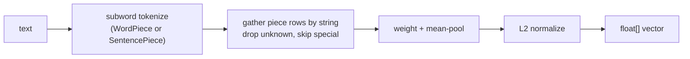
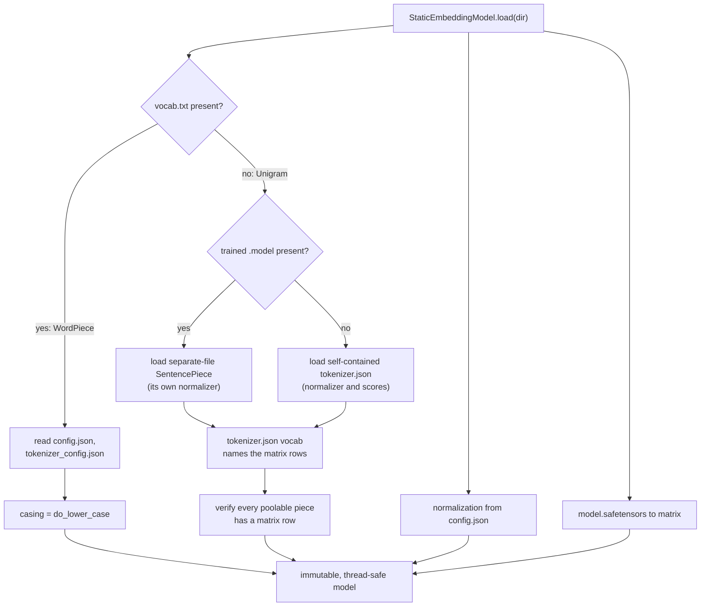
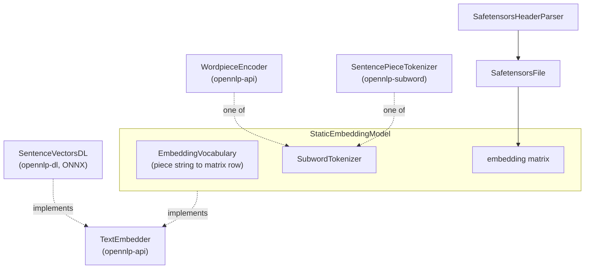

<!--
   Licensed to the Apache Software Foundation (ASF) under one or more
   contributor license agreements.  See the NOTICE file distributed with
   this work for additional information regarding copyright ownership.
   The ASF licenses this file to You under the Apache License, Version 2.0
   (the "License"); you may not use this file except in compliance with
   the License.  You may obtain a copy of the License at

       http://www.apache.org/licenses/LICENSE-2.0

   Unless required by applicable law or agreed to in writing, software
   distributed under the License is distributed on an "AS IS" BASIS,
   WITHOUT WARRANTIES OR CONDITIONS OF ANY KIND, either express or implied.
   See the License for the specific language governing permissions and
   limitations under the License.
-->

# OpenNLP Static Embeddings

Turn text into embedding vectors from a static (non-contextual) table: a per-token vector matrix plus WordPiece or SentencePiece tokenization. The module loads [Model2Vec](https://github.com/MinishLab/model2vec) layouts and can distill a sentence-transformer into the same flat-table form. SentencePiece support permits multilingual tables distilled from encoders in the [XLM-RoBERTa](https://arxiv.org/abs/1911.02116) family. Embedding uses JVM table lookups and arithmetic, without a model forward pass or native runtime.

OpenNLP also supports contextual ONNX models, which preserve word-sense context at a higher inference cost. Both embedding methods implement the same `TextEmbedder` interface.

## Quickstart

Point `load` at a downloaded model directory, then embed:

```java
StaticEmbeddingModel model = StaticEmbeddingModel.load(Path.of("/path/to/model-directory"));

float[] vector     = model.embed("The quick brown fox");
double  similarity = model.similarity("coffee", "espresso");
List<Neighbor> near = model.mostSimilar("coffee", 5);
```

The directory is the layout published releases use, and `load` detects the tokenizer family from the files present. A WordPiece model carries `vocab.txt`, `model.safetensors`, `config.json`, and `tokenizer_config.json`. A self-contained Model2Vec Unigram model carries `tokenizer.json`, `model.safetensors`, and `config.json`. A separate-file SentencePiece model uses the Unigram layout and adds its trained `sentencepiece.bpe.model`, `spiece.model`, or `tokenizer.model`. The tokenizer and pooling switches are read from the model's own configuration. One loaded model is immutable and thread-safe, so it can serve every thread of an application.

A multilingual SentencePiece table can compare text in the languages covered by its teacher:

```java
double crossLingual = model.similarity(
    "The weather is beautiful today", "今天天气很好");
```

## When to use it

Use static embeddings when throughput and deployment simplicity matter: semantic similarity, deduplication, candidate retrieval before a reranker, clustering, or classifier features. Use a contextual model when the task depends on distinguishing word senses in context.

## How it works

A static embedding model is a vocabulary and a matrix: one row per token, each row a vector of the model's dimension. Embedding runs entirely as table lookups and arithmetic:


```mermaid
flowchart LR
  A["text"] --> B["subword tokenize<br/>(WordPiece or SentencePiece)"]
  B --> C["gather piece rows by string<br/>drop unknown, skip special"]
  C --> D["weight + mean-pool"]
  D --> E["L2 normalize"]
  E --> F["float[] vector"]
```

1. **Tokenize.** The model's own subword tokenizer splits the text into pieces: WordPiece with the model's casing rule, or a trained SentencePiece model that carries its own text normalizer. Special pieces (the WordPiece `[CLS]`, `[SEP]`, and `[UNK]` tokens, a SentencePiece model's control and unknown pieces) never contribute to the pooled vector.
2. **Gather.** Each piece contributes its matrix row, found by the piece *string* instead of the tokenizer's numeric id. The two files of a SentencePiece model may order or offset their ids differently, so string lookup keeps them aligned. Loading rejects a poolable piece with no matrix row. Unknown pieces are omitted, and text with no known pieces embeds to a zero vector.
3. **Weight and pool.** Per-token weights (when present) multiply into the running sum, which is divided by the number of pooled tokens. This is the pooling rule used by Model2Vec tables.
4. **Normalize.** The pooled vector is L2-normalized by default so cosine similarity is a dot product. Normalization can be turned off for models that expect raw pooled vectors.

Per-row L2 norms and the special-token mask are precomputed at load time, so the neighbor scan and similarity calls do not recompute them on every query.

### Loading

The one-argument `load` reads the model's own configuration to resolve the tokenizer and pooling switches, so callers do not restate them:


```mermaid
flowchart TD
  L["StaticEmbeddingModel.load(dir)"] --> DET{"vocab.txt present?"}
  DET -- "yes: WordPiece" --> WCFG["read config.json,<br/>tokenizer_config.json"]
  WCFG --> CAS["casing = do_lower_case"]
  DET -- "no: Unigram" --> SPM{"trained .model present?"}
  SPM -- "yes" --> SEP["load separate-file SentencePiece<br/>(its own normalizer)"]
  SPM -- "no" --> SELF["load self-contained tokenizer.json<br/>(normalizer and scores)"]
  SEP --> TJ["tokenizer.json vocab<br/>names the matrix rows"]
  SELF --> TJ
  TJ --> COV["verify every poolable piece<br/>has a matrix row"]
  L --> NRM["normalization from config.json"]
  L --> MAT["model.safetensors to matrix"]
  CAS --> M["immutable, thread-safe model"]
  COV --> M
  NRM --> M
  MAT --> M
```

The weights are read with a small [safetensors](https://github.com/huggingface/safetensors) reader. It parses a JSON header and raw tensor bytes, without deserializing Java or Python objects. Tensor data streams directly into the decoded array. A decoded tensor is limited to the maximum Java array length, about 2.1 billion float elements.

## Architecture


```mermaid
flowchart TD
  subgraph MODEL["StaticEmbeddingModel"]
    EV["EmbeddingVocabulary<br/>(piece string to matrix row)"]
    ST["SubwordTokenizer"]
    MX["embedding matrix"]
  end
  WE["WordpieceEncoder<br/>(opennlp-api)"] -. one of .-> ST
  SP["SentencePieceTokenizer<br/>(opennlp-subword)"] -. one of .-> ST
  SHP["SafetensorsHeaderParser"] --> SF["SafetensorsFile"]
  SF --> MX
  MODEL -. implements .-> TE["TextEmbedder<br/>(opennlp-api)"]
  DL["SentenceVectorsDL<br/>(opennlp-dl, ONNX)"] -. implements .-> TE
```

`SubwordTokenizer` provides one piece stream for the WordPiece encoder in `opennlp-api` and the pure-JVM SentencePiece implementation in `opennlp-subword`. `TextEmbedder` provides one embedding contract for this static implementation and the contextual ONNX implementation in `opennlp-dl`.

## Performance

A static table avoids a model forward pass. Its embedding path performs vocabulary lookups, vector additions, pooling, and optional normalization. The Java Microbenchmark Harness (JMH) benchmark (`StaticEmbeddingModelBenchmark`) measures `embed()` and `mostSimilar()` throughput on a model directory (`-p modelDir=/path/to/model`).

`embed()` tokenizes and pools only the rows used by the input. `mostSimilar()` scans every matrix row, so its cost grows with the vocabulary. Use a vector index when a full scan is too expensive. The harness in `dev/embeddings/parity/` compares single-thread speed and vector output with the Model2Vec Python implementation. Run it with the model and hardware used for deployment.

## Quantizing a model

`QuantizeModel` converts `model.safetensors` to a 2, 3, or 4-bit matrix:

```text
opennlp-embeddings QuantizeModel -modelDir /path/to/model-directory -bits 4
```

The command writes `model.quantized` and reports its size and sampled reconstruction cosine.
Delete `model.safetensors` before loading the quantized model. A directory containing both matrix
files is rejected. The tokenizer, configuration, and optional `terms.txt` stay unchanged.

The format uses a randomized Hadamard transform, a Gaussian Lloyd-Max grid, and a scale for each
row. It is an MSE-oriented variant of
[TurboQuant](https://arxiv.org/abs/2504.19874) and does not implement the paper's residual QJL
estimator.

## Usage

### Loading a non-standard layout

For a model laid out differently, the explicit overloads take the data files and the model properties directly. WordPiece:

```java
StaticEmbeddingModel model = StaticEmbeddingModel.load(
    Path.of("vocab.txt"), Path.of("model.safetensors"),
    StaticEmbeddingModel.Casing.UNCASED,      // from the model's do_lower_case
    StaticEmbeddingModel.Normalization.L2);   // from the model's config
```

SentencePiece (no casing switch, because the `.model` file carries the model's own text normalizer):

```java
StaticEmbeddingModel model = StaticEmbeddingModel.loadSentencePiece(
    Path.of("sentencepiece.bpe.model"), Path.of("tokenizer.json"),
    Path.of("model.safetensors"),
    StaticEmbeddingModel.Normalization.L2);
```

### Neighbors and analogies

`Neighbor` is a small record of the token and its cosine similarity:

```java
for (Neighbor n : model.mostSimilar("coffee", 5)) {
  System.out.println(n.token() + "  " + n.similarity());
}

List<Neighbor> king = model.analogy("man", "king", "woman", 1);
```

### Retrieval

For a small corpus, rank documents directly with `similarity`:

```java
StaticEmbeddingModel model = StaticEmbeddingModel.load(modelDir);

List<String> docs = List.of(
    "How do I brew espresso at home?",
    "The history of tea in East Asia",
    "Best grinders for pour-over coffee");

String query = "home espresso machine";

IntStream.range(0, docs.size())
    .boxed()
    .sorted(Comparator.comparingDouble(
        (Integer i) -> model.similarity(query, docs.get(i))).reversed())
    .forEach(i -> System.out.println(docs.get(i)));
```

For a larger corpus, embed each document once, store the vectors in a vector index, and embed each query with the same model. Any index that accepts float vectors, including a Hierarchical Navigable Small World (HNSW) index, can store these embeddings.

### Bounded in-memory search

`FlatFloatIndex` scans full-precision vectors for exact cosine scores. `TurboQuantIndex` scans packed 2-bit, 3-bit, or 4-bit rows, using less memory at the cost of recall. Both are for bounded collections in one JVM. Build either index on one thread, freeze it, then share it for concurrent queries:

```java
StaticEmbeddingModel model = StaticEmbeddingModel.load(modelDir);
VectorIndex index = new TurboQuantIndex(model.dimension(), 4, 42L);

index.add("wonderland-excerpt", model.embed("Alice met the Queen in the garden."));
index.add("orchard-notes", model.embed("A ripe apple hangs from the tree."));
index.freeze();

List<VectorIndex.Hit> hits = index.topK(model.embed("queen"), 5);
```

A frozen, non-empty index can be written to a directory and loaded through the concrete class's `write(Path)` and `read(Path)` methods. The directory includes a SHA-256 manifest, so loading rejects a changed or mismatched vector or id file. Rebuild the index to add, replace, or remove a vector.

## Getting a model

No model is bundled. Point the module at files you download, and the table's own license applies to the table. The Model2Vec distilled releases (for example potion-base-8M) publish the exact directory layout the one-argument `load` expects: download that release's `vocab.txt`, `model.safetensors`, `config.json`, and `tokenizer_config.json` into one directory and pass the directory to `load`. Or distill your own teacher with the module's `DistillModel` command (see `TRAINING.md`).

For a multilingual SentencePiece table (for example one distilled from a bge-m3 or XLM-RoBERTa teacher), the distillation output ships `tokenizer.json`, `model.safetensors`, and `config.json` but usually not the trained SentencePiece `.model` file. Copy `sentencepiece.bpe.model` from the teacher repository into the same directory. A missing file is reported during loading.

## Notes and limits

- Instances are immutable and safe for concurrent use, so one loaded model serves every thread.
- Static tables do not disambiguate word senses in context. If the task turns on context, use a contextual model.
- Input with no known pieces embeds to a zero vector. Decide whether that represents "no signal" for the application.

## See also

- [`TRAINING.md`](TRAINING.md) for distilling your own table from a sentence-transformer teacher, including the multilingual SentencePiece worked example.
- The Dev Manual chapter (`opennlp-docs/src/docbkx/embeddings.xml`) for the same material in the manual.
- `opennlp-dl` for the contextual, ONNX-backed sentence vector path, which shares the `TextEmbedder` interface with this module.
